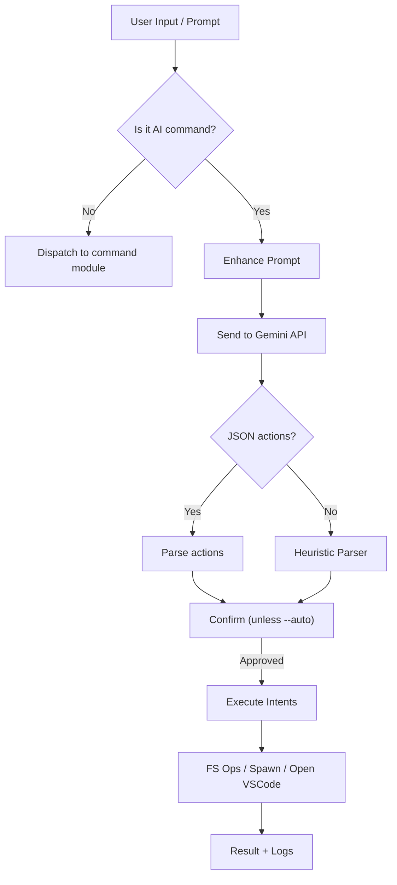

# Raze CLI

An intelligent, modular developer command‑line assistant that:

- Provides an interactive REPL (`raze start`) with shell‑like file commands (pwd, ls, cd, mkdir, touch, rm)
- Leverages an AI command (`raze ai ...`) that can:
  - Understand natural language ("create a project structure", "make 3 files", "remove all folders")
  - Parse or request structured JSON action plans
  - Execute filesystem operations safely (mkdir / touch / rm)
  - Orchestrate multi‑step development tasks (create Next.js / Vite / Rust / Python / Go / Flutter projects, install deps, start servers, open VS Code)
  - Perform cross‑platform command adaptation (translates some Unix patterns for Windows)

> Platform focus so far: Windows (PowerShell) with fallbacks for Unix‑style commands.

---

## Table of Contents

1. [Quick Start](#quick-start)
2. [Installation](#installation)
3. [Core Concepts](#core-concepts)
4. [Command Reference](#command-reference)
5. [AI Action System](#ai-action-system)
6. [Flow & Architecture](#flow--architecture)
7. [Examples](#examples)
8. [Safety / Guardrails](#safety--guardrails)
9. [Extending the AI](#extending-the-ai)
10. [Roadmap](#roadmap)
11. [FAQ](#faq)

---

## Quick Start

```bash
# Clone
git clone https://github.com/razeprotocol/raze-cli.git
cd raze-cli/cli/my-web3-cli

# Install dependencies
npm install

# (Optional) Set your Gemini API key
$env:GEMINI_API_KEY = "YOUR_KEY"   # PowerShell
# or
export GEMINI_API_KEY="YOUR_KEY"   # bash/zsh

# Use the CLI
node ./index.js --help
# Or add to PATH via npm link (optional)
npm link
raze --help
```

Start an interactive session:

```bash
raze start
```

Run an AI task directly:

```bash
raze ai "create a rust project and open it in vs code"
```

---

## Installation

### From Source

1. Clone the repository
2. Navigate to `cli/my-web3-cli`
3. Install dependencies: `npm install`
4. (Optional) `npm link` for global `raze` command

### Requirements

| Component | Minimum                                           |
| --------- | ------------------------------------------------- |
| Node.js   | 18+ (uses global `fetch`)                         |
| OS        | Windows (primary tested), Linux/macOS (basic ops) |
| Network   | Required for AI (Gemini API)                      |

---

## Core Concepts

**Modular Commands** – Each command lives in `commands/` and registers itself with Commander.

**Interactive REPL** – `raze start` launches a loop where you can type command names directly (no `raze` prefix inside the session).

**AI Interpreter** – Natural language → Structured JSON (preferred) → Executed intents.

**Heuristic Fallback** – If AI returns plain text, regex‑based parsing extracts actions (mkdir/touch/rm/technology bootstrap patterns).

**Cross‑Platform Normalization** – Some Unix commands are translated to Windows equivalents (e.g. bulk folder removal).

---

## Command Reference

| Command             | Description                                                 |
| ------------------- | ----------------------------------------------------------- |
| `raze ai [prompt]`  | Ask the AI to interpret and/or execute developer/file tasks |
| `raze start`        | Interactive session (REPL)                                  |
| `raze pwd`          | Print current working directory                             |
| `raze ls [dir]`     | List directory contents                                     |
| `raze cd <dir>`     | Change directory (non‑REPL form prints resolved path)       |
| `raze mkdir <name>` | Create directory (recursive)                                |
| `raze touch <file>` | Create or update a file                                     |
| `raze rm <target>`  | Remove file or directory (supports recursive)               |

### AI Options

| Flag          | Meaning                                             |
| ------------- | --------------------------------------------------- |
| `--model <m>` | Gemini model (default: `gemini-1.5-flash-latest`)   |
| `--auto`      | Skip confirmation and execute actions automatically |
| `--force`     | Force delete operations / ignore missing targets    |

---

## AI Action System

The AI is encouraged to return JSON:

```json
{
  "actions": [
    { "action": "mkdir", "target": "my-app", "recursive": true },
    {
      "action": "run_command",
      "command": "npm create vite@latest frontend",
      "cwd": "./my-app"
    },
    {
      "action": "run_command",
      "command": "npm install",
      "cwd": "./my-app/frontend"
    },
    { "action": "open_vscode", "path": "./my-app" }
  ]
}
```

### Supported Action Types

| Action                             | Required Fields                | Notes                                                           |
| ---------------------------------- | ------------------------------ | --------------------------------------------------------------- |
| `mkdir`                            | target                         | Creates folder (recursive always allowed)                       |
| `touch`                            | target                         | Creates file or updates timestamp                               |
| `rm`                               | target                         | `recursive` flag required for directories                       |
| `run_command`                      | command [, cwd] [, background] | Spawns shell; on Windows uses `cmd.exe /c` for complex commands |
| `open_vscode`                      | path                           | Launches VS Code (`code`) if on PATH                            |
| _(heuristic)_ technology bootstrap | natural language               | Auto‑expands (e.g. rust/python/go/nextjs/vite/vue)              |

### Normalization Logic

- If both `target` and `path` absent → logged as _undefined_ before fix (now handled)
- `cd xyz && <other>` patterns are **future improvement** candidates to split into structured steps (see Roadmap)

---

## Flow & Architecture

### High‑Level Execution Flow



### File Structure

```
my-web3-cli/
  index.js                # Commander entrypoint
  commands/
    ai.js                 # AI orchestration + parsing + execution
    start.js              # REPL
    filemanagement/*.js   # pwd, mkdir, touch, cd, ls, rm
  utils/common.js         # helpers (levenshtein, arg parsing, banner)
  package.json
  tsconfig.json (if TS expansion needed later)
```

---

## Examples

### Simple Filesystem

```bash
raze ai "create 3 folders alpha beta gamma"
raze ai "remove all folders"         # Bulk removal heuristic
raze ai "make folder structure"      # Creates src, docs, tests, README.md
```

### Full Stack (Next + Express)

```bash
raze ai "create a project with nextjs frontend and node express backend and open it"
```

### Technology Bootstraps

```bash
raze ai "create a rust project"
raze ai "setup python virtual environment"
raze ai "create go project and run"
raze ai "create flutter app"
```

### Auto‑Execution

```bash
raze ai --auto "make 2 files index.js utils.js"
```

---

## Safety / Guardrails

Current implemented:

- Confirmation prompt unless `--auto`
- `--force` required to ignore missing targets on deletion
- Basic path normalization

Recommended next steps (not yet implemented):

- Add `--dry-run` to preview actions
- Whitelist root (avoid leaving project directory)
- Maintain `.raze-ai.log` audit file
- Sandboxed execution / allow‑deny prompt for dangerous commands (e.g. `rm -rf`, registry edits)

---

## Extending the AI

1. Add new action: implement in `executeIntent` inside `commands/ai.js`
2. Teach the AI: update the enhanced prompt template describing the new action JSON fields
3. Add heuristic pattern if you want it to work without JSON
4. (Optional) Add tests / sample prompts

---

## Roadmap

| Feature                                  | Status     | Notes                                      |
| ---------------------------------------- | ---------- | ------------------------------------------ |
| Clean modularization                     | ✅         | Completed                                  |
| Basic FS commands                        | ✅         | pwd/ls/cd/mkdir/touch/rm                   |
| AI JSON parsing                          | ✅         | Extract code blocks or first JSON object   |
| Multi‑action execution                   | ✅         | Arrays executed sequentially               |
| Heuristic tech bootstrap                 | ✅         | Rust, Python, Go, Flutter, Next, Vite, Vue |
| Cross‑platform command normalization     | ⚠️ Partial | More PowerShell translation needed         |
| Background processes                     | ✅         | `background: true` for run_command         |
| VS Code opening                          | ✅         | `open_vscode`                              |
| Bulk removal safe pattern                | ✅         | Windows vs Unix mapping                    |
| Structured splitting of chained commands | ⏳ Planned | e.g. split `cd x && npm install`           |
| Dry run mode                             | ⏳ Planned | `--dry-run` flag                           |
| Path sandboxing                          | ⏳ Planned | Prevent accidental system‑wide ops         |
| Persistent action log                    | ⏳ Planned | `.raze-ai.log`                             |
| Unit test suite                          | ⏳ Planned | Parser + executor                          |
| Plugin system                            | ⏳ Idea    | Load external action providers             |

---

## FAQ

**Q: Why do some AI commands fail on Windows?**  
A: The AI may emit Unix tooling (`find`, `xargs`). We translate some patterns, but not all—roadmap includes smarter translation.

**Q: What if AI returns plain text instructions?**  
Parser heuristics attempt extraction. If nothing recognized, output is shown untouched.

**Q: Can I force JSON only?**  
You can update the enhanced prompt or wrap `raze ai` in a script that rejects non‑JSON responses.

**Q: How do I add a new programming stack (e.g., SvelteKit)?**  
Extend the technology switch in `interpretFileIntent` and update the prompt instructions.

---

## Contributing

PRs welcome! Suggested first issues:

- Implement `--dry-run`
- Add audit log file
- Improve chained command splitting
- Expand Windows command translation matrix

---

## License

ISC (see `package.json`).

---

## GitHub Badge / Link

If this is published to GitHub, add a badge:

```markdown
[](https://github.com/razeprotocol/raze-cli)
```

---

## Changelog (Summary of Work So Far)

- Initial monolith refactored into modular command system
- Added file management commands (pwd, mkdir, touch, cd, ls, rm)
- Implemented interactive REPL with persistent cwd
- Introduced AI command with Gemini integration
- Added heuristic + JSON hybrid parsing layer
- Implemented multi‑action execution & confirmation gating
- Added technology bootstrap heuristics (multiple stacks)
- Added cross‑platform command normalization (initial set)
- Extended actions: run_command, open_vscode, install_deps (concept), create_project (partial)
- Added bulk folder/file removal heuristics
- Improved prompt injection with structured JSON spec

---

## Support / Issues

Open an issue on GitHub with:

- Repro steps
- Prompt used
- AI raw response (if parsing failed)
- Node version / OS

Happy building! 🚀
