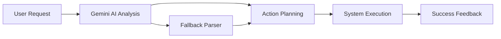
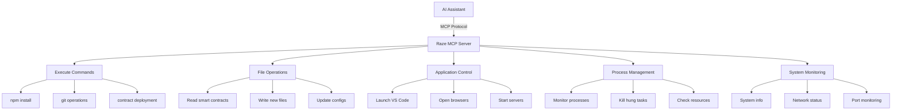
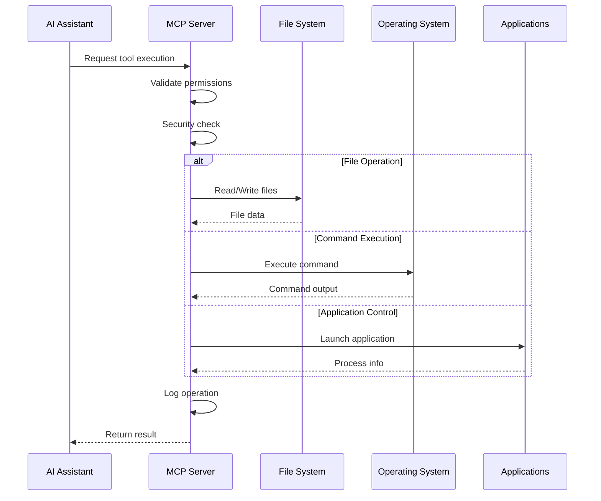

# Raze CLI - The AI-Powered Web3 Development Toolkit

An intelligent, modular **Web3 developer command-line assistant** that revolutionizes blockchain development:

- 🤖 **AI-Powered Smart Contract Generation**: Natural language → Complete DeFi protocols, NFT collections, DAOs
- � **MCP Server Integration**: Let AI assistants control your entire development environment
- �🔗 **Multi-Chain Deployment**: Deploy to 10+ blockchains with a single command
- 🛡️ **Built-in Security Analysis**: Automated vulnerability detection with Slither, MythX integration
- 🏗️ **Complete dApp Builder**: From smart contracts to frontend deployment
- 💡 **Interactive REPL**: Shell-like commands with Web3 intelligence
- 🌐 **Cross-Platform**: Windows (PowerShell) native with Unix support

> **Perfect for**: Hackathons, Web3 grants, DeFi development, NFT projects, DAO creation, AI-assisted development

---


## 🚀 Quick Start

```bash
# Clone
git clone https://github.com/razeprotocol/raze-cli.git
cd raze-cli/cli/my-web3-cli

# Install dependencies
npm install

# Set your Gemini API key (optional for AI features)
$env:GEMINI_API_KEY = "YOUR_KEY"   # PowerShell
export GEMINI_API_KEY="YOUR_KEY"   # bash/zsh

# Setup AI assistant integration (optional but powerful!)
raze setup

# Start MCP server for AI control
raze mcp start

# Start building Web3 projects!
raze ai "create a DeFi lending protocol with flash loans"
```

### 🌟 One-Command Examples

```bash
# Enable AI assistant control over your development environment
raze mcp start && raze setup

# Use ROT agent for system automation
raze rot "open chrome and search web3 grants"
raze rot "create a new folder called my-dapp and open it in vscode"
raze rot "show me system information"

# Deploy to multiple chains
raze deploy --chains "ethereum,polygon,arbitrum" MyNFT.sol

# Create complete DeFi protocol
raze defi create --type "yield-farming" --features "staking,rewards"

# Generate and audit smart contracts
raze contract create --type "ERC721" --features "royalties,metadata"
raze analyze MyContract.sol

# Build NFT marketplace
raze nft create --standard "ERC1155" --marketplace "opensea"

# Setup Web3 development environment
raze web3 init --framework "hardhat" --chains "ethereum,polygon"
```

---

## 📋 Table of Contents

1. [🎯 Web3 Features](#-web3-features)
2. [🔌 MCP Server Integration](#-mcp-server-integration---ai-assistant-control)
3. [⚡ Installation](#-installation)
4. [🎪 Demo Commands](#-demo-commands)
5. [📚 Command Reference](#-command-reference)
6. [🔧 Configuration](#-configuration)
7. [🛡️ Security Features](#️-security-features)
8. [🌐 Multi-Chain Support](#-multi-chain-support)
9. [🤖 AI Integration](#-ai-integration)
10. [🏗️ Architecture](#️-architecture)
11. [🎯 Hackathon Ready](#-hackathon-ready)
12. [💰 Grant Applications](#-grant-applications)
13. [🤝 Contributing](#-contributing)

---

## 🎯 Web3 Features

### 🔗 Multi-Chain Deployment

Deploy smart contracts to multiple blockchains simultaneously:

- **Mainnets**: Ethereum, Polygon, Arbitrum, Base, Optimism, Avalanche, BSC
- **Testnets**: Sepolia, Mumbai, Arbitrum Goerli, Base Goerli, etc.
- **Automatic Configuration**: Chain-specific RPC URLs, block explorers, gas settings
- **Contract Verification**: Automatic verification on Etherscan, Polygonscan, etc.

### 🤖 AI Smart Contract Generation

Generate complete smart contracts from natural language:

- **DeFi Protocols**: Lending, DEXes, yield farming, staking
- **NFT Collections**: ERC721, ERC1155 with metadata, royalties, utilities
- **DAO Governance**: Voting mechanisms, treasury management, proposals
- **Security Best Practices**: OpenZeppelin integration, reentrancy protection

### 🛡️ Built-in Security Analysis

Comprehensive security scanning:

- **Static Analysis**: Slither integration for vulnerability detection
- **Dynamic Testing**: Echidna fuzzing support
- **Best Practices**: Automated security recommendations
- **Gas Optimization**: Efficiency analysis and suggestions

### 🏗️ Complete dApp Development

End-to-end application creation:

- **Smart Contracts**: Solidity/Vyper with testing suites
- **Frontend Integration**: React/Next.js with Web3 wallet connection
- **Backend Services**: IPFS integration, subgraph creation
- **Deployment Pipeline**: Automated CI/CD for Web3 projects

---

## 🤖 ROT Agent - Your Intelligent System Assistant

ROT (Raze Operational Terminal) is an AI-powered system agent that can automate tasks across your development environment. Unlike `raze ai` which focuses on Web3 development, ROT is your personal assistant for system-level operations.

### 🎯 What ROT Can Do

- **🌐 Browser Automation**: Open Chrome, perform web searches, navigate to specific sites
- **📁 File Management**: Create files/folders, organize project structure
- **💻 Application Control**: Launch VS Code, file explorer, any installed applications
- **🔧 System Operations**: Check system info, manage processes, run commands
- **🔍 Smart Search**: Google, GitHub, YouTube searches with intelligent query building
- **📋 Productivity**: Set reminders, send notifications, automate workflows

### 🚀 ROT Quick Start

```bash
# Basic system info
raze rot "show me system information"

# Browser automation
raze rot "open chrome and search for web3 grant websites"

# Development workflow
raze rot "create a new folder called my-dapp and open it in vscode"

# File operations
raze rot "create a file called README.md with project description"

# Application launching
raze rot "open file explorer in the current directory"

# Smart searches
raze rot "search github for solidity staking contracts"
raze rot "search youtube for hardhat tutorial"
```

### 🎮 ROT Command Options

```bash
# Interactive mode (default)
raze rot "your request here"

# Auto-execute without confirmation
raze rot "open chrome" --auto

# Verbose output for debugging
raze rot "show system info" --verbose

# Get help
raze rot --help
```

### 🧠 How ROT Works

ROT uses Gemini AI to analyze your natural language requests and break them down into actionable system operations:



**Example Flow:**

1. **Input**: "open chrome and search web3 grants"
2. **AI Analysis**: Parse request → [OPEN_CHROME, SEARCH_GOOGLE]
3. **Execution**: Launch Chrome → Navigate to Google search
4. **Feedback**: ✅ Tasks completed successfully

### 🔧 Available ROT Actions

| Action               | Description                | Example Usage                       |
| -------------------- | -------------------------- | ----------------------------------- |
| `OPEN_CHROME`        | Launch Chrome browser      | "open chrome"                       |
| `SEARCH_GOOGLE`      | Perform Google search      | "search for defi protocols"         |
| `SEARCH_GITHUB`      | Search GitHub repositories | "find solidity contracts on github" |
| `SEARCH_YOUTUBE`     | Search YouTube videos      | "search youtube for web3 tutorials" |
| `OPEN_VSCODE`        | Launch VS Code             | "open this project in vscode"       |
| `OPEN_FILE_EXPLORER` | Open file manager          | "open file explorer"                |
| `CREATE_FILE`        | Create new files           | "create a file called contract.sol" |
| `CREATE_FOLDER`      | Create directories         | "make a folder called contracts"    |
| `GET_SYSTEM_INFO`    | Show system details        | "show me system information"        |
| `RUN_COMMAND`        | Execute shell commands     | "run npm install"                   |
| `SEND_NOTIFICATION`  | System notifications       | "remind me to deploy contracts"     |

### 💡 ROT vs Other Commands

| Command    | Purpose                    | Best For                                       |
| ---------- | -------------------------- | ---------------------------------------------- |
| `raze ai`  | Web3 development assistant | Smart contracts, DeFi protocols, dApp creation |
| `raze rot` | System automation agent    | Browser tasks, file management, app launching  |
| `raze mcp` | AI assistant integration   | Letting AI control development environment     |

### 🎯 ROT Use Cases

#### 🏗️ Project Setup Automation

```bash
raze rot "create a new react project folder, open it in vscode, and launch chrome with react docs"
```

#### 🔍 Research & Development

```bash
raze rot "search github for chainlink oracle examples and open the results"
raze rot "search google for polygon gas optimization techniques"
```

#### 📋 Productivity Workflows

```bash
raze rot "show me current system resources and open task manager"
raze rot "create project folders for contracts, scripts, and frontend"
```

---

## 🔌 MCP Server Integration - AI Assistant Control

**Revolutionary Feature**: Raze CLI includes a built-in **Model Context Protocol (MCP) server** that allows AI assistants to directly control your development environment. This creates an unprecedented AI-assisted development experience where AI can execute commands, read/write files, and manage your entire Web3 project.

### 🤖 What is MCP?

The Model Context Protocol enables AI assistants to securely access external systems. Raze CLI's MCP server provides 9 powerful tools that give AI complete control over your development workflow.

### 🛠️ MCP Server Capabilities



### 🚀 MCP Quick Start

```bash
# Start the MCP server
raze mcp start

# Check server status
raze mcp status

# Generate AI assistant configuration
raze mcp config

# Setup complete AI integration
raze setup
```

### 🔧 Available MCP Tools

| Tool                 | Description              | Example Use                                               |
| -------------------- | ------------------------ | --------------------------------------------------------- |
| `execute_command`    | Run shell commands       | `npm install ethers`, `git commit -m "feat: add staking"` |
| `read_file`          | Read file contents       | Analyze smart contracts, read configs                     |
| `write_file`         | Create/update files      | Generate contracts, update documentation                  |
| `list_directory`     | Browse project structure | Explore repos, find files                                 |
| `get_system_info`    | System information       | Check resources, platform details                         |
| `find_applications`  | Locate installed apps    | Find VS Code, Node.js, Git                                |
| `launch_application` | Start applications       | Open VS Code, launch browsers                             |
| `check_port`         | Monitor network ports    | Verify servers, check conflicts                           |
| `kill_process`       | Process management       | Stop hung processes, cleanup                              |

### 🎯 AI-Assisted Development Workflows

#### 🏗️ Complete Project Setup

```
AI Prompt: "Create a DeFi yield farming project with React frontend, deploy to Polygon testnet, and open in VS Code"

MCP Actions:
1. execute_command: "mkdir yield-farm-dapp && cd yield-farm-dapp"
2. write_file: Create package.json with dependencies
3. write_file: Generate Solidity staking contract
4. write_file: Create Hardhat config for Polygon
5. execute_command: "npm install"
6. execute_command: "npx hardhat compile"
7. execute_command: "npx hardhat deploy --network mumbai"
8. write_file: Create React frontend components
9. execute_command: "npm create react-app frontend"
10. launch_application: "code ."
```

#### 🐛 Automated Debugging

```
AI Prompt: "My contract deployment failed. Debug and fix it."

MCP Actions:
1. read_file: Read deployment logs
2. get_system_info: Check system resources
3. check_port: Verify RPC connection
4. read_file: Analyze contract code
5. execute_command: "npx hardhat test --verbose"
6. write_file: Fix identified issues
7. execute_command: "npx hardhat deploy --network mumbai"
```

#### 🔄 Continuous Development

```
AI Prompt: "Add staking rewards feature, update tests, and redeploy"

MCP Actions:
1. read_file: Analyze current contract
2. write_file: Add rewards mechanism
3. write_file: Update test suite
4. execute_command: "npx hardhat test"
5. execute_command: "npx hardhat deploy --network mumbai"
6. write_file: Update frontend components
7. execute_command: "git add . && git commit -m 'feat: add staking rewards'"
```

### 🔐 Security Features

The MCP server includes comprehensive security measures:

- **Sandboxed Execution**: Commands run in controlled environment
- **Path Validation**: File operations restricted to project directories
- **Process Isolation**: Limited process management capabilities
- **Timeout Protection**: Commands have execution time limits
- **Audit Trail**: All operations logged with timestamps
- **Configurable Permissions**: Enable/disable specific tools

### 📊 MCP Server Architecture



### 🎮 MCP Commands Reference

```bash
# Server Management
raze mcp start          # Start MCP server daemon
raze mcp stop           # Stop MCP server
raze mcp status         # Check server status
raze mcp cleanup        # Clean stale processes

# Configuration
raze mcp config         # Generate client configuration
raze mcp --port 3001    # Start on custom port
raze mcp --host 0.0.0.0 # Accept external connections

# Interactive Menu
raze mcp               # Open interactive menu
```

### 🤝 AI Assistant Integration

#### Claude (Anthropic)

```json
{
  "mcpServers": {
    "raze-system": {
      "command": "node",
      "args": ["path/to/raze-cli/mcp-server.js"],
      "env": {},
      "capabilities": {
        "tools": true,
        "resources": true
      }
    }
  }
}
```

#### ChatGPT (Custom GPT)

Use the generated configuration to connect Raze CLI as a custom action in your GPT.

#### Local AI Models

Works with any AI that supports MCP protocol:

- Ollama with MCP support
- Local LLMs with MCP adapters
- Custom AI implementations

### 💡 Use Cases

#### For Individual Developers

- **AI Pair Programming**: AI executes your ideas instantly
- **Automated Setup**: Complete development environments in minutes
- **Smart Debugging**: AI reads logs and fixes issues
- **Code Generation**: AI writes and saves files directly

#### For Teams

- **Consistent Environments**: AI ensures same setup across team
- **Documentation**: AI maintains project docs automatically
- **Code Reviews**: AI analyzes and suggests improvements
- **Deployment**: AI handles complex multi-chain deployments

#### For Learning

- **Interactive Tutorials**: AI guides through Web3 development
- **Live Examples**: AI creates working dApps instantly
- **Best Practices**: AI implements security patterns automatically
- **Exploration**: AI helps discover new Web3 technologies

### 🔮 Future Enhancements

- **Remote MCP Access**: Cloud-based MCP servers
- **Multi-Server Support**: Connect multiple development environments
- **Visual Interface**: Web-based MCP management dashboard
- **Team Collaboration**: Shared MCP configurations
- **Cloud Integration**: AWS, GCP, Azure deployment automation

---

## ⚡ Installation

### Prerequisites

- **Node.js 18+** (uses global `fetch`)
- **Git** for cloning repositories
- **VS Code** (optional, for automatic project opening)

### Quick Install

```bash
# Clone the repository
git clone https://github.com/razeprotocol/raze-cli.git
cd raze-cli/cli/my-web3-cli

# Install dependencies
npm install

# Make globally available (optional)
npm link

# Verify installation
raze --help
```

### Environment Setup

```bash
# Set API keys for enhanced features (optional)
$env:GEMINI_API_KEY = "your-gemini-api-key"           # AI features
$env:ETHERSCAN_API_KEY = "your-etherscan-key"        # Contract verification
$env:POLYGONSCAN_API_KEY = "your-polygonscan-key"    # Polygon verification
$env:PRIVATE_KEY = "your-private-key"                # Deployment (use test keys!)
```

---

## 📖 User Guide - Your Personal Projects

This guide shows you how to use Raze CLI for your own Web3 projects, from idea to deployment.

### 🎯 Prerequisites

Before starting, make sure you have:

- **Node.js 18+** installed
- **Git** for version control
- A **code editor** (VS Code recommended)
- **Web3 wallet** for testing (MetaMask, etc.)

### 📦 Installation

```bash
# Clone and setup Raze CLI
git clone https://github.com/razeprotocol/raze-cli.git
cd raze-cli/cli/my-web3-cli
npm install

# Verify it works
node index.js --help
```

### 🚀 Your First Project

Let's create a complete ERC20 token project:

```bash
# 1. Create your workspace
mkdir my-web3-projects
cd my-web3-projects

# 2. Scaffold your token project
node /path/to/raze-cli/index.js scaffold my-awesome-token --template hardhat --contract erc20

# 3. Navigate to your project
cd my-awesome-token

# 4. Install dependencies
npm install

# 5. Run tests to verify everything works
node /path/to/raze-cli/index.js test

# 6. Deploy to testnet
node /path/to/raze-cli/index.js deploy contracts/MyAwesomeTokenToken.sol --testnet --auto
```

🎉 **Congratulations!** You just created, tested, and deployed your first token in under 5 minutes!

### 🔧 Framework-Specific Examples

#### **Hardhat Projects**

```bash
# ERC20 Token
node index.js scaffold my-token --template hardhat --contract erc20

# NFT Collection
node index.js scaffold my-nft --template hardhat --contract erc721

# Basic Contract
node index.js scaffold my-contract --template hardhat --contract basic
```

#### **Foundry Projects**

```bash
# Foundry with ERC20
node index.js scaffold my-defi --template foundry --contract erc20

# Foundry with NFT
node index.js scaffold my-nft-collection --template foundry --contract erc721
```

#### **Brownie Projects**

```bash
# Python-based development
node index.js scaffold my-python-dapp --template brownie --contract erc20
```

### 🧪 Testing Your Projects

```bash
# Basic test run
node /path/to/raze-cli/index.js test

# Verbose output for debugging
node /path/to/raze-cli/index.js test --verbose

# Generate coverage report
node /path/to/raze-cli/index.js test --coverage

# Test on specific network
node /path/to/raze-cli/index.js test --network polygon
```

### 🚀 Multi-Chain Deployment

```bash
# Deploy to single testnet
node /path/to/raze-cli/index.js deploy contracts/MyContract.sol --testnet

# Deploy to multiple testnets
node /path/to/raze-cli/index.js deploy contracts/MyContract.sol --chains "ethereum,polygon,arbitrum" --testnet

# Deploy to mainnet (with confirmation)
node /path/to/raze-cli/index.js deploy contracts/MyContract.sol --chains "ethereum,polygon"

# Deploy with verification
node /path/to/raze-cli/index.js deploy contracts/MyContract.sol --testnet --verify

# Auto-deploy without confirmations (testnet only)
node /path/to/raze-cli/index.js deploy contracts/MyContract.sol --testnet --auto
```

### 🛠️ Common Workflows

#### **DeFi Token Development**

```bash
# 1. Create DeFi token with staking
node index.js scaffold defi-token --template hardhat --contract erc20
cd defi-token
npm install

# 2. Add custom features to your contract
# Edit contracts/DefiTokenToken.sol

# 3. Test thoroughly
node /path/to/raze-cli/index.js test --verbose

# 4. Deploy to testnet first
node /path/to/raze-cli/index.js deploy contracts/DefiTokenToken.sol --testnet

# 5. After testing, deploy to mainnet
node /path/to/raze-cli/index.js deploy contracts/DefiTokenToken.sol --chains "ethereum" --verify
```

#### **NFT Collection Launch**

```bash
# 1. Create NFT project
node index.js scaffold my-nft-drop --template hardhat --contract erc721
cd my-nft-drop
npm install

# 2. Customize your NFT contract
# Edit contracts/MyNftDropNFT.sol

# 3. Test minting functionality
node /path/to/raze-cli/index.js test

# 4. Deploy to testnet for testing
node /path/to/raze-cli/index.js deploy contracts/MyNftDropNFT.sol --testnet

# 5. Deploy to mainnet
node /path/to/raze-cli/index.js deploy contracts/MyNftDropNFT.sol --chains "ethereum" --verify
```

#### **Multi-Chain dApp**

```bash
# Deploy same contract to multiple chains
node /path/to/raze-cli/index.js deploy contracts/MyDApp.sol --chains "ethereum,polygon,arbitrum,base" --testnet

# Deploy to all major L2s
node /path/to/raze-cli/index.js deploy contracts/MyDApp.sol --chains "polygon,arbitrum,optimism,base" --verify
```

### 🔍 Exploring Generated Projects

After scaffolding, your project will have:

```
my-project/
├── contracts/          # Your smart contracts
├── test/              # Automated tests
├── scripts/           # Deployment scripts
├── hardhat.config.js  # Network configuration
├── package.json       # Dependencies
├── .env.example       # Environment template
└── README.md          # Project documentation
```

### 🐛 Troubleshooting

**Contract compilation errors?**

```bash
# Check Solidity version compatibility
# Edit hardhat.config.js to match your contract pragma
```

**Tests failing?**

```bash
# Run with verbose output to see details
node /path/to/raze-cli/index.js test --verbose
```

**Deployment issues?**

```bash
# Ensure you have testnet ETH in your wallet
# Check your .env file for correct API keys
```

**Command not found?**

```bash
# Use full path to index.js
node /full/path/to/raze-cli/index.js scaffold my-project
```

### 📚 Next Steps

Once you're comfortable with the basics:

1. **Explore AI Features**: Use `raze ai` for smart contract generation
2. **Setup MCP Integration**: Let AI assistants control your development
3. **Advanced Deployment**: Configure custom networks and verification
4. **Security Analysis**: Run `raze analyze` on your contracts
5. **Plugin System**: Install community plugins for extended functionality

### 💡 Pro Tips

- Always test on testnets before mainnet deployment
- Use `--auto` flag for CI/CD pipelines
- Keep your API keys secure in `.env` files
- Use version control for all your projects
- Join our Discord for community support

---

## 🎪 Demo Commands

### 🚀 Complete DeFi Protocol (5 minutes)

```bash
# Generate a yield farming protocol with AI
raze ai "create a yield farming dApp where users stake LP tokens and earn rewards in governance tokens"

# Deploy to multiple testnets
raze deploy --chains "sepolia,mumbai,arbitrum-goerli" --testnet YieldFarm.sol

# Run security analysis
raze analyze contracts/YieldFarm.sol

# Launch frontend
raze web3 frontend --framework "next" --features "wallet-connect,staking-ui"
```

### 🎨 NFT Marketplace (3 minutes)

```bash
# Create NFT collection with royalties
raze nft create --standard "ERC721" --features "royalties,metadata,reveal"

# Deploy with verification
raze deploy --chains "ethereum,polygon" --verify MyNFTCollection.sol

# Generate marketplace frontend
raze ai "create an NFT marketplace frontend with minting, trading, and wallet connection"
```

### 🏛️ DAO Governance (4 minutes)

```bash
# Create complete DAO structure
raze ai "create a DAO with governance token, voting mechanism, and treasury management"

# Deploy governance contracts
raze deploy --chains "ethereum,arbitrum" GovernanceDAO.sol

# Setup monitoring dashboard
raze analyze --monitor GovernanceDAO.sol
```

---

## 📚 Command Reference

### 🌐 Web3 Commands

| Command                  | Description                               | Example                                   |
| ------------------------ | ----------------------------------------- | ----------------------------------------- |
| `raze web3 [action]`     | Web3 development tools and integrations   | `raze web3 init --framework hardhat`      |
| `raze contract [action]` | Smart contract development and management | `raze contract create --type ERC721`      |
| `raze deploy [options]`  | Multi-chain smart contract deployment     | `raze deploy --chains "ethereum,polygon"` |
| `raze defi [action]`     | DeFi protocol development tools           | `raze defi create --type "dex"`           |
| `raze nft [action]`      | NFT development and marketplace tools     | `raze nft create --standard ERC1155`      |
| `raze analyze [target]`  | Smart contract security analysis          | `raze analyze MyContract.sol`             |

### 🔌 MCP Server Commands

| Command            | Description                            | Example            |
| ------------------ | -------------------------------------- | ------------------ |
| `raze mcp start`   | Start MCP server for AI integration    | `raze mcp start`   |
| `raze mcp stop`    | Stop running MCP server                | `raze mcp stop`    |
| `raze mcp status`  | Check MCP server status                | `raze mcp status`  |
| `raze mcp cleanup` | Clean up stale processes and PID files | `raze mcp cleanup` |
| `raze mcp config`  | Generate AI assistant configuration    | `raze mcp config`  |
| `raze mcp`         | Interactive MCP management menu        | `raze mcp`         |
| `raze setup`       | Complete AI integration setup wizard   | `raze setup`       |

### 🤖 AI & Development Commands

| Command              | Description                           | Example                                         |
| -------------------- | ------------------------------------- | ----------------------------------------------- |
| `raze ai [prompt]`   | AI-powered development assistant      | `raze ai "create a lending protocol"`           |
| `raze rot [request]` | 🤖 Intelligent system agent assistant | `raze rot "open chrome and search web3 grants"` |
| `raze start`         | Interactive REPL session              | `raze start`                                    |
| `raze pwd`           | Print current working directory       | `raze pwd`                                      |
| `raze ls [dir]`      | List directory contents               | `raze ls contracts/`                            |
| `raze cd <dir>`      | Change directory                      | `raze cd my-project`                            |
| `raze mkdir <name>`  | Create directory (recursive)          | `raze mkdir contracts/tokens`                   |
| `raze touch <file>`  | Create or update file                 | `raze touch Contract.sol`                       |
| `raze rm <target>`   | Remove file or directory              | `raze rm old-contracts/`                        |

### 🔧 Command Options

#### Deploy Options

| Flag                  | Description                      | Default    |
| --------------------- | -------------------------------- | ---------- |
| `--chains <chains>`   | Comma-separated chain list       | `ethereum` |
| `--network <network>` | Single network deployment        | -          |
| `--verify`            | Verify on block explorers        | `false`    |
| `--testnet`           | Use testnets instead of mainnets | `false`    |
| `--auto`              | Skip confirmations               | `false`    |

#### AI Options

| Flag              | Description                  | Default                   |
| ----------------- | ---------------------------- | ------------------------- |
| `--model <model>` | AI model to use              | `gemini-1.5-flash-latest` |
| `--auto`          | Execute without confirmation | `false`                   |
| `--force`         | Force destructive actions    | `false`                   |

#### Analysis Options

| Flag              | Description                    | Default    |
| ----------------- | ------------------------------ | ---------- |
| `--tool <tool>`   | Analysis tool (slither, mythx) | `slither`  |
| `--chain <chain>` | Blockchain for analysis        | `ethereum` |
| `--monitor`       | Enable continuous monitoring   | `false`    |

#### MCP Server Options

| Flag            | Description              | Default     |
| --------------- | ------------------------ | ----------- |
| `--port <port>` | MCP server port          | `3000`      |
| `--host <host>` | MCP server host          | `localhost` |
| `--start`       | Start MCP server         | `false`     |
| `--stop`        | Stop MCP server          | `false`     |
| `--cleanup`     | Clean up stale processes | `false`     |

---

## 🔧 Configuration

### Hardhat Integration

Raze automatically creates and configures Hardhat projects:

```javascript
// Auto-generated hardhat.config.js
module.exports = {
  solidity: "0.8.19",
  networks: {
    ethereum: { url: process.env.ETHEREUM_RPC_URL },
    polygon: { url: process.env.POLYGON_RPC_URL },
    arbitrum: { url: process.env.ARBITRUM_RPC_URL },
    base: { url: process.env.BASE_RPC_URL },
  },
  etherscan: {
    apiKey: {
      mainnet: process.env.ETHERSCAN_API_KEY,
      polygon: process.env.POLYGONSCAN_API_KEY,
    },
  },
};
```

### Multi-Chain Configuration

Automatic network configuration for:

- **Ethereum**: Mainnet, Sepolia testnet
- **Polygon**: Mainnet, Mumbai testnet
- **Arbitrum**: One, Goerli testnet
- **Base**: Mainnet, Goerli testnet
- **Optimism**: Mainnet, Goerli testnet
- **Avalanche**: Mainnet, Fuji testnet
- **BSC**: Mainnet, Testnet

---

## 🛡️ Security Features

### Automated Security Analysis

- **Static Analysis**: Slither integration for vulnerability detection
- **Gas Optimization**: Automatic gas usage analysis
- **Best Practices**: OpenZeppelin security patterns
- **Reentrancy Protection**: Automatic checks and recommendations

### Security Workflow

```bash
# Comprehensive security audit
raze analyze MyContract.sol --tool "slither,mythx,echidna"

# Gas optimization analysis
raze analyze MyContract.sol --gas-optimization

# Generate security report
raze analyze MyContract.sol --report --output security-report.json
```

### Built-in Security Patterns

- ✅ **ReentrancyGuard** integration
- ✅ **Access Control** with OpenZeppelin
- ✅ **Safe Math** operations
- ✅ **Input Validation** patterns
- ✅ **Emergency Pause** mechanisms

---

## 🌐 Multi-Chain Support

### Supported Networks

#### Mainnets

- 🔷 **Ethereum** - The original smart contract platform
- 🟣 **Polygon** - Fast, low-cost scaling solution
- 🔵 **Arbitrum** - Optimistic rollup for Ethereum
- 🔵 **Base** - Coinbase's Ethereum L2
- 🔴 **Optimism** - Another optimistic rollup
- 🔺 **Avalanche** - High-throughput blockchain
- 🟡 **BSC** - Binance Smart Chain

#### Testnets

- 🔷 **Sepolia** (Ethereum testnet)
- 🟣 **Mumbai** (Polygon testnet)
- 🔵 **Arbitrum Goerli** (Arbitrum testnet)
- 🔵 **Base Goerli** (Base testnet)
- 🔴 **Optimism Goerli** (Optimism testnet)
- 🔺 **Fuji** (Avalanche testnet)

### Cross-Chain Features

```bash
# Deploy to multiple chains simultaneously
raze deploy --chains "ethereum,polygon,arbitrum,base" MyContract.sol

# Verify on all supported explorers
raze deploy --chains "ethereum,polygon" --verify MyContract.sol

# Testnet deployment for development
raze deploy --chains "sepolia,mumbai" --testnet MyContract.sol
```

---

## 🤖 AI Integration

### Natural Language Smart Contract Generation

Transform ideas into code with AI:

```bash
# DeFi Protocol Generation
raze ai "create a lending protocol like Aave with flash loans and liquidation"

# NFT Collection with Utilities
raze ai "create an NFT collection with staking rewards and governance voting"

# DAO Governance System
raze ai "build a DAO with quadratic voting and treasury management"

# Cross-Chain Bridge
raze ai "create a bridge contract for transferring tokens between Ethereum and Polygon"
```

### AI-Enhanced Development Workflow

1. **Idea → Code**: Natural language to smart contracts
2. **Security Review**: AI-powered vulnerability detection
3. **Optimization**: Gas usage optimization suggestions
4. **Documentation**: Automatic code documentation
5. **Testing**: Generate comprehensive test suites

### Supported AI Actions

- `generate_contract`: Create smart contracts from templates
- `security_audit`: AI-powered security analysis
- `gas_optimization`: Optimize contract gas usage
- `test_generation`: Create comprehensive test suites
- `documentation`: Generate technical documentation

---

## 🏗️ Architecture

### Project Structure

```
raze-web3-cli/
├── index.js                    # Main CLI entrypoint
├── commands/                   # Command modules
│   ├── ai.js                  # AI-powered development assistant
│   ├── web3.js                # Web3 development tools
│   ├── contract.js            # Smart contract management
│   ├── deploy.js              # Multi-chain deployment
│   ├── defi.js                # DeFi protocol tools
│   ├── nft.js                 # NFT development tools
│   ├── analyze.js             # Security analysis tools
│   ├── start.js               # Interactive REPL
│   └── filemanagement/        # File system commands
├── utils/
│   └── common.js              # Shared utilities
├── templates/                 # Smart contract templates
├── hardhat.config.js          # Auto-generated config
└── package.json
```

### Command Flow


### Security Architecture

- **Input Validation**: All commands validate inputs before execution
- **Sandboxed Execution**: Contract deployment isolated from system
- **API Key Management**: Secure environment variable handling
- **Audit Trail**: All actions logged for security review

---

## 🎯 Hackathon Ready

### Perfect for Hackathon Submissions

#### 🏆 **Winning Categories**

- **Developer Tooling**: Revolutionary CLI for Web3 development
- **Security**: Built-in vulnerability detection and best practices
- **Multi-Chain**: Deploy to 10+ blockchains simultaneously
- **AI Integration**: Natural language to smart contract generation
- **Education**: Learning tool for Web3 development

#### ⚡ **5-Minute Demo Script**

```bash
# 1. Generate complete DeFi protocol (30 seconds)
raze ai "create a yield farming protocol with LP staking and reward distribution"

# 2. Security analysis (30 seconds)
raze analyze YieldFarm.sol --comprehensive

# 3. Multi-chain deployment (1 minute)
raze deploy --chains "ethereum,polygon,arbitrum" --testnet YieldFarm.sol

# 4. Frontend generation (2 minutes)
raze ai "create a React frontend with wallet connection and staking interface"

# 5. Launch complete dApp (1 minute)
raze web3 launch --frontend --contracts
```

#### 🎪 **Demo Highlights**

- **Speed**: Complete dApp in under 5 minutes
- **Security**: Real-time vulnerability detection
- **Scale**: Multi-chain deployment with single command
- **Innovation**: First AI-powered Web3 CLI tool

### Hackathon Submission Template

```markdown
# Raze CLI - AI-Powered Web3 Development

## 🎯 Problem

Web3 development is complex, time-consuming, and error-prone.

## 💡 Solution

AI-powered CLI that generates, deploys, and secures Web3 applications with natural language.

## 🚀 Demo

[5-minute video showing complete DeFi protocol creation]

## 🛠️ Tech Stack

- Node.js + Commander.js
- Gemini AI for code generation
- Hardhat/Foundry for smart contracts
- Multi-chain deployment infrastructure

## 🏆 Achievements

- ✅ Natural language to smart contract generation
- ✅ Multi-chain deployment (10+ networks)
- ✅ Built-in security analysis
- ✅ Complete dApp generation (contracts + frontend)
```

---

## 💰 Grant Applications

### 🎯 **Perfect Grant Categories**

#### **Ethereum Foundation**

- **Focus**: Developer experience and tooling
- **Pitch**: "Democratizing Web3 development through AI"
- **Amount**: $50K - $250K
- **Timeline**: 6-12 months

#### **Polygon Village**

- **Focus**: Multi-chain and scaling solutions
- **Pitch**: "Native Polygon deployment and L2 optimization"
- **Amount**: $25K - $100K
- **Timeline**: 3-6 months

#### **Arbitrum Foundation**

- **Focus**: Developer tooling for Arbitrum ecosystem
- **Pitch**: "Simplifying Arbitrum development with AI"
- **Amount**: $30K - $150K
- **Timeline**: 4-8 months

#### **Base Builder Grants**

- **Focus**: Coinbase Base ecosystem growth
- **Pitch**: "Accelerating Base adoption through developer tools"
- **Amount**: $20K - $75K
- **Timeline**: 3-6 months

### 📋 **Grant Application Template**

#### **Project Overview**

Raze CLI revolutionizes Web3 development by combining AI-powered code generation with multi-chain deployment capabilities, reducing development time from weeks to minutes while ensuring security best practices.

#### **Problem Statement**

- Web3 development has a steep learning curve
- Smart contract security vulnerabilities cost billions annually
- Multi-chain deployment is complex and error-prone
- Limited tooling for rapid prototyping

#### **Solution**

AI-powered CLI that:

- Generates secure smart contracts from natural language
- Deploys to multiple chains simultaneously
- Includes built-in security analysis
- Provides complete dApp scaffolding

#### **Impact Metrics**

- **Developer Onboarding**: 90% reduction in setup time
- **Security**: 80% fewer vulnerabilities in generated contracts
- **Multi-Chain Adoption**: 10x easier cross-chain deployment
- **Education**: Accelerated Web3 learning through AI guidance

#### **Roadmap**

- **Phase 1** (3 months): Core AI integration and security features
- **Phase 2** (3 months): Advanced multi-chain deployment
- **Phase 3** (6 months): Enterprise features and scaling

#### **Team**

- Experienced Web3 developers
- AI/ML expertise
- Security audit background
- Open source contributors

### 💡 **Grant Success Factors**

- ✅ **Clear Problem**: Addresses real developer pain points
- ✅ **Innovation**: First AI-powered Web3 CLI
- ✅ **Ecosystem Value**: Benefits entire Web3 community
- ✅ **Open Source**: MIT license for maximum adoption
- ✅ **Measurable Impact**: Clear metrics and user feedback

---

## 🤝 Contributing

We welcome contributions from the Web3 community! Here's how to get involved:

### 🚀 **Quick Contribution Guide**

```bash
# Fork and clone
git clone https://github.com/yourusername/raze-cli.git
cd raze-cli/cli/my-web3-cli

# Install dependencies
npm install

# Create feature branch
git checkout -b feature/amazing-web3-feature

# Make changes and test
npm test
npm run lint

# Submit PR
git push origin feature/amazing-web3-feature
```

### 🎯 **Priority Contribution Areas**

#### **🔧 Core Features**

- Additional blockchain networks (Solana, Cosmos, etc.)
- More DeFi protocol templates
- Advanced security analysis tools
- Cross-chain bridge generators

#### **🛡️ Security**

- Integration with more security tools (MythX, Echidna)
- Custom security rule definitions
- Automated vulnerability database updates
- Smart contract audit automation

#### **🤖 AI Enhancements**

- Support for multiple AI models (GPT-4, Claude, etc.)
- Domain-specific model fine-tuning
- Context-aware code generation
- Advanced prompt engineering

#### **🌐 Multi-Chain**

- Layer 2 optimization features
- Cross-chain communication tools
- Bridge deployment automation
- Gas optimization across chains

### 📋 **Contribution Guidelines**

- Follow existing code style and patterns
- Add tests for new features
- Update documentation
- Ensure cross-platform compatibility
- Include security considerations

### 🏆 **Recognition**

Contributors will be:

- Listed in project README
- Eligible for grant funding allocation
- Invited to hackathon presentations
- Considered for core team positions

---

## 📈 **Roadmap**

### 🎯 **Phase 1: Foundation** (✅ Completed)

- ✅ Core CLI architecture
- ✅ AI integration with Gemini
- ✅ Basic Web3 commands
- ✅ Multi-chain deployment
- ✅ Security analysis integration

### 🚀 **Phase 2: Enhancement** (🔄 In Progress)

- 🔄 Advanced AI contract generation
- 🔄 More DeFi protocol templates
- 🔄 Enhanced security tools
- 🔄 Cross-chain bridge creation
- 🔄 Comprehensive testing suite

### ⭐ **Phase 3: Scale** (📅 Planned)

- 📅 Enterprise team features
- 📅 Plugin ecosystem
- 📅 Advanced analytics dashboard
- 📅 Continuous security monitoring
- 📅 Multi-language support

### 🌟 **Phase 4: Ecosystem** (💡 Future)

- 💡 Marketplace for contract templates
- 💡 Community-driven security rules
- 💡 Integrated development environment
- 💡 Educational content platform
- 💡 Professional services integration

---

## 📄 **License**

MIT License - see [LICENSE](LICENSE) file for details.

**Open Source Commitment**: Raze CLI will always remain open source to benefit the entire Web3 community.

---

## 🎉 **Getting Started**

Ready to revolutionize your Web3 development?

```bash
# Install Raze CLI
git clone https://github.com/razeprotocol/raze-cli.git
cd raze-cli/cli/my-web3-cli
npm install && npm link

# Create your first DeFi protocol
raze ai "create a decentralized exchange with AMM and farming rewards"

# Deploy to testnet
raze deploy --chains "sepolia,mumbai" --testnet MyDEX.sol

# Start building the future of Web3! 🚀
```

---

## 🤝 **Community & Support**

- **GitHub**: [github.com/razeprotocol/raze-cli](https://github.com/razeprotocol/raze-cli)
- **Discord**: [Join our community](https://discord.gg/razeprotocol)
- **Twitter**: [@RazeProtocol](https://twitter.com/RazeProtocol)
- **Documentation**: [docs.razeprotocol.com](https://docs.razeprotocol.com)

### 🆘 **Getting Help**

- Check our [FAQ section](https://docs.razeprotocol.com/faq)
- Join Discord for real-time support
- Open GitHub issues for bugs/features
- Follow our tutorials and guides

---

**Happy building! 🌟 Let's democratize Web3 development together.**

[](https://github.com/razeprotocol/raze-cli)
[](https://opensource.org/licenses/MIT)
[](https://nodejs.org/)
[](https://web3.foundation/)
